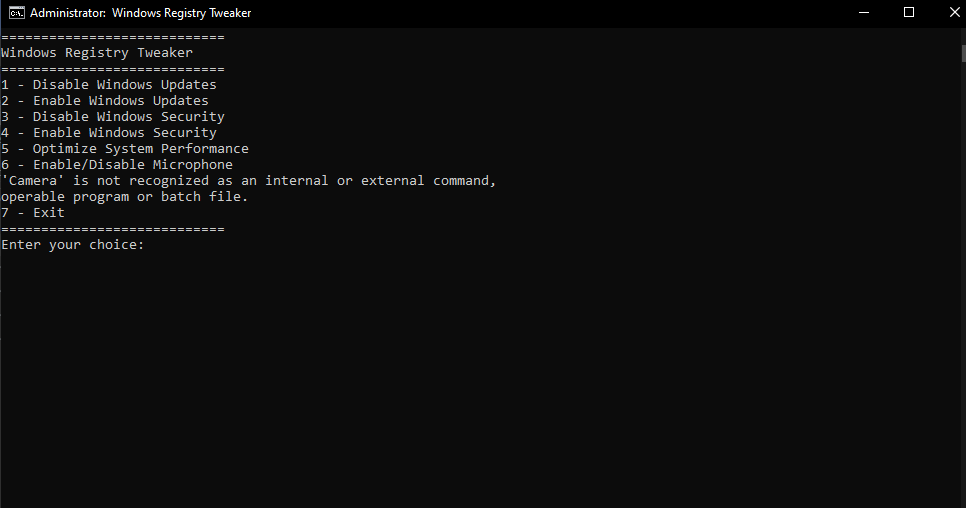

# TweakBeast
A batch script to modify Windows registry settings, 100% permanent disable/enable updates, optimize performance, and manage security settings

## Screenshots

This project is open-source, and contributions are welcome!

## Features
- **Disable/Enable Windows Updates permanently**
- **Disable/Enable Windows Security (Windows Defender)**
- **Optimize system performance by clearing cache and temporary files**
- **Enable/Disable Microphone & Camera permissions system-wide**
- **Works on all versions of Windows 10 and 11**

## How to Use

1. **Download** the `TweakBeast.bat` file from the repository.
2. **Right-click** the file and choose **Run as Administrator**.
3. A command-line interface will open with a menu where you can select the action you'd like to perform.
4. Select an option (e.g., `1` to disable Windows Updates) and follow the on-screen instructions.

## Commands Available:

- `1` - Disable Windows Updates permanently
- `2` - Enable Windows Updates
- `3` - Disable Windows Security (Windows Defender)
- `4` - Enable Windows Security
- `5` - Optimize System Performance (clears temp files, prefetch, etc.)
- `6` - Enable/Disable Microphone & Camera permissions
- `7` - Exit the script

## Contributing

Contributions are always welcome! If you find any bugs or want to add new features, feel free to fork this project and create a pull request.

### Steps to contribute:
1. Fork the repository.
2. Clone your fork to your local machine.
3. Create a new branch for your changes (`git checkout -b feature-name`).
4. Make your changes and commit them (`git commit -m 'Add new feature'`).
5. Push to the branch (`git push origin feature-name`).
6. Open a pull request to merge your changes.

## License

This project is licensed under the MIT License - see the [LICENSE](LICENSE) file for details.

---

## Disclaimer

This script modifies system settings. Please ensure that you are comfortable with the changes it makes before running the script.

---
